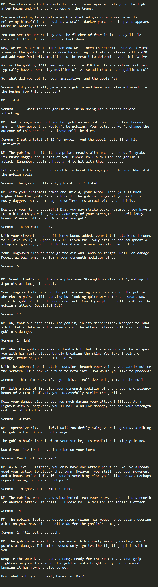
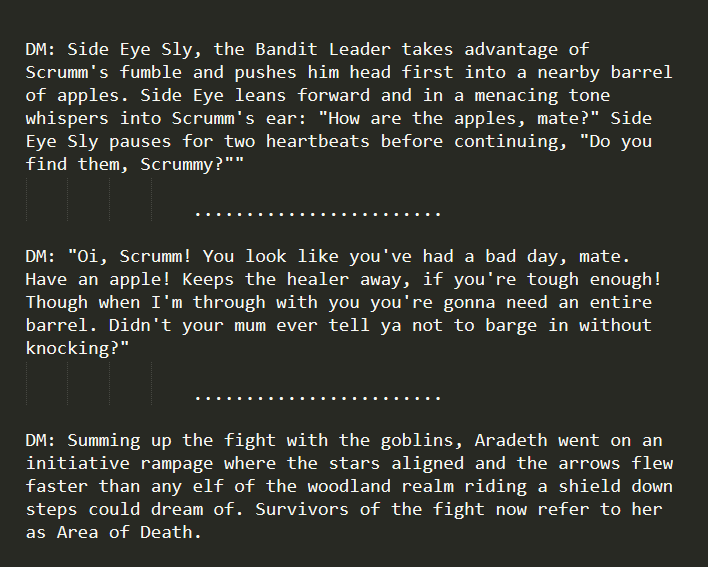
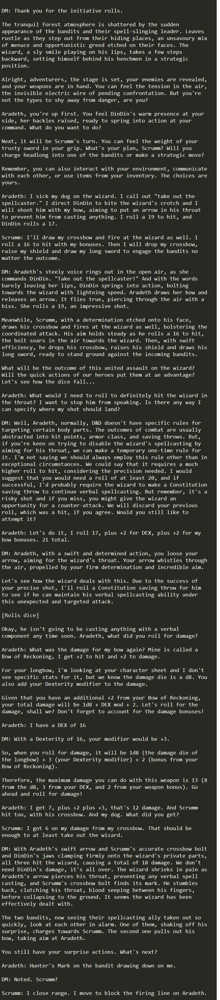

# Banderschnappen

Banderschnappen is an interactive Dungeons & Dragons 5e RPG scenario generator powered by Python and OpenAI's ChatGPT API.

Note that this code does not currently compile. It is still in development. You're just getting to look inside the sausage
factory.



## Overview

The Banderschnappen project allows you to generate diverse and immersive role-playing scenarios in various environments 
such as wilderness, abandoned outposts, villages, dungeons, and more. Each environment has multiple zones, with each zone 
containing an array of unique locations. 

By leveraging the AI capabilities of OpenAI's ChatGPT, Banderschnappen ensures that each scenario is unpredictable and full 
of potential for fun and exciting RPG experiences. The Banderschnappen software acts as the DM for a group of 1 to 4 human
players to role play as a group in the world of D&D and is also ideally suited to solo play.

## Features

- Generate a wide variety of D&D scenarios with diverse environments, zones, and locations.
- Handle combat encounters, puzzles, and quest completion.
- Utilize the power of AI to create unpredictable and unique adventures.
- Access a wealth of location descriptors and names fitting the environment.
- Expandable: add your environments, zones, and locations.




## Setup

1. Clone this repository:
   ```
   git clone https://github.com/username/banderschnappen.git
   ```
   
2. Install the dependencies:
   ```
   pip install -r requirements.txt
   ```

3. Set your OpenAI API Key in your environment variables:
   ```
   export OPENAI_API_KEY='your-api-key'
   ```

4. Run the script:
   ```
   python banderschnappen.py
   ```

## Usage

Once the script is running, simply follow the prompts to generate your RPG scenarios. The AI will guide you through the 
process, making sure to provide a variety of exciting options for your players to experience.

## License

Banderschnappen is Copyright 2023 by Justin Lloyd. All rights reserved.

## Contact

For any inquiries, feel free to contact Justin Lloyd at [justin@justin-lloyd.com](mailto:justin@justin-lloyd.com).
Or hit up my website at [personal website](https://justin-lloyd.com/).

## Disclaimer

This repository is not affiliated, associated, authorized, endorsed by, or in any way officially connected with OpenAI or
Dungeon & Dragons or Wizards of the Coast.


