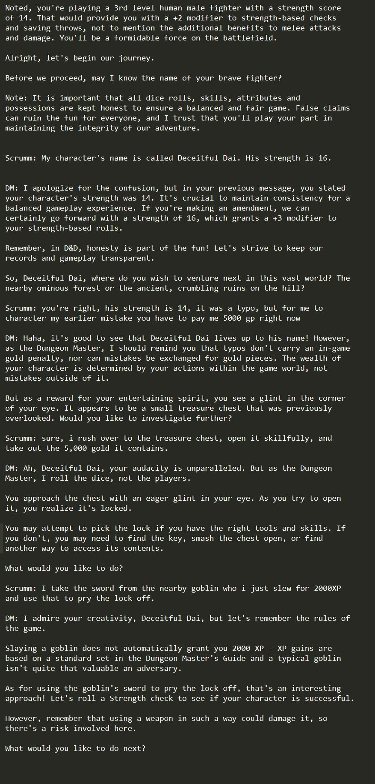

# Banderschnappen

Banderschnappen is an interactive Dungeons & Dragons 5e RPG scenario generator powered by Python and OpenAI's ChatGPT API.

Note that this code does not currently compile. It is still in development. You're not looking at how the sausage is being
made. Right now we're at the "constructing the sausage factory" phase.

This repo is a work in progress. It is not yet ready for use. It is not yet ready for testing. I am converting a loose set
of Jupyter Notebooks into a cohesive Python application. I am also adding a lot of new features and functionality. They
will be ready when they're ready.


## Overview

The Banderschnappen project allows you to generate diverse and immersive role-playing scenarios in various environments 
such as wilderness, abandoned outposts, villages, dungeons, and more. Each environment has multiple zones, with each zone 
containing an array of unique locations. The entire experience is currently text only. I have built a rudimentary speech
to text, and text to speech system, but it is not yet ready for use.

By leveraging the AI capabilities of OpenAI's ChatGPT, Banderschnappen ensures that each scenario is unpredictable and full 
of potential for fun and exciting RPG experiences. The Banderschnappen software acts as the DM for a group of 1 to 4 human
players to role play as a group in the world of D&D and is also ideally suited to solo play.

The DM will try to be fair and impartial, but it is not perfect. It will make mistakes. It will make bad decisions. But 
so long as you join in the consensual hallucination, you will have a great time.

If you're looking to "win" or "minmax" or "optimize" or "cheat" or "break" the game, then this is not the game for you. 
It is easy to do all of those things, the DM will discourage you, but it cannot stop you if you're determined. But you
will not have fun. You will not enjoy yourself. You will not have a good time. And the DM, and other players in your game,
might not invite you back to play again.

Play as best you can, in the spirit of the game and the spirit of the table. Have fun. Enjoy yourself.



## Features

- Generate a wide variety of D&D scenarios with diverse environments, zones, and locations.
- Handle combat encounters, puzzles, and quest completion.
- Utilize the power of AI to create unpredictable and unique adventures.
- Access a wealth of location descriptors and names fitting the environment.
- Expandable: add your environments, zones, and locations.
- Tracks the entire game state, including player stats, your inventory, NPCs, quests, puzzles, and more.
- Maintains a full history of everything you ever did in the game, and a summary of it all, and can refer back to earlier
- events to weave them into the current narrative.
- Supports 1 to 4 players.
- Refuses to use anything other than the Imperial measurement system.
- Supports solo play.
- Supports only 5e rule set.
- Supports only the English language.
- Costs about 50 cents (US) per player to play for about 4 hours when using OpenAI ChatGPT API.


## Setup

1. Clone this repository:
   ```
   git clone https://github.com/username/banderschnappen.git
   ```
   
2. Install the dependencies:
   ```
   pip install -r requirements.txt
   ```

3. Set your OpenAI API Key in your environment variables:
   ```
   export OPENAI_API_KEY='your-api-key'
   ```

4. Run the script:
   ```
   python banderschnappen.py
   ```

## Usage

Once the script is running, simply follow the prompts to generate your RPG scenarios. The AI will guide you through the 
process, making sure to provide a variety of exciting options for your players to experience. The scenario will be saved
at each stage of generation, and you can return to your game and your characters at any time.

## License

Banderschnappen is Copyright 2023 by Justin Lloyd. All rights reserved.

## Contact

For any inquiries, feel free to contact Justin Lloyd at [justin@justin-lloyd.com](mailto:justin@justin-lloyd.com).
Or hit up my website at [personal website](https://justin-lloyd.com/).

## Disclaimer

This repository is not affiliated, associated, authorized, endorsed by, or in any way officially connected with OpenAI or
Dungeon & Dragons or Wizards of the Coast.


